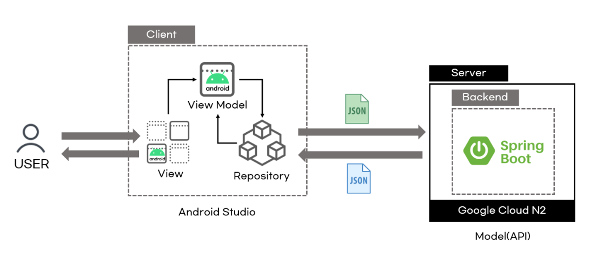
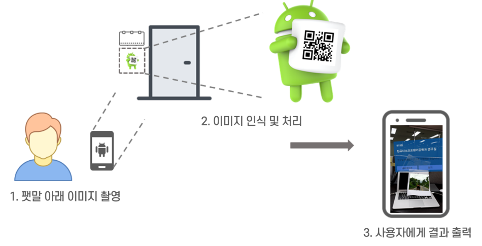

# Client

## Function

- AR 호실 안내 기능
  - 이미지 인식을 통한 호실 정보 출력 기능으로, AR 환경에서 학과 정보와 안내 영상을 포함한 뷰를 출력한다.
- AR 내비게이션 기능
  - 현재 인식한 호실을 기준으로, 목표 호실까지 안내한다.
- 학과 정보 제공 기능
  - 학과 정보, 학과 소식, 공지사항, 커리큘럼, 교수진, 취업현황 등의 정보를 각각 제공한다.
- 알림 기능
  - 관리자가 웹에서 전송한 알림을 수신한다.

## Model

- MVVM
  - 뷰-모델을 분리하여 결합도를 낮추었다.
- Observer 패턴
  - LiveData와 Observable을 활용하여 데이터 변화에 즉각 대응하도록 하였다.
- Singleton 패턴
  - Retrofit 객체를 싱글턴으로 구현하였다.
  - 필요에 따라 데이터셋에 맞는 값을 반환하는 콜백함수를 호출하였다.

## AR 

- [ARCore](https://developers.google.com/ar/develop)
  - ARCore는 가장 널리 사용되는 여러 개발 환경을위한 SDK를 제공합니다. 이러한 SDK는 모션 추적, 환경 이해 및 조명 추정과 같은 모든 필수 AR 기능에 대한 기본 API를 제공합니다. 이러한 기능을 통해 완전히 새로운 AR 경험을 구축하거나 AR 기능으로 기존 앱을 향상시킬 수 있습니다.

- [Sceneform](https://developers.google.com/sceneform/develop)
  - Sceneform을 사용하면 OpenGL을 배우지 않고도 AR 및 비 AR 앱에서 사실적인 3D 장면을 쉽게 렌더링 할 수 있습니다. 
  1. 높은 수준의 장면 그래프 API
  2. Filament에서 제공 하는 사실적인 물리적 기반 렌더러
  3. 안드로이드 스튜디오 플러그인 3D 자산을 가져보기 및 구축

> ARCore, Sceneform을 사용한 학과(강의실) 안내 기능

## Environment

| 구분                     | 내용                                                         | 비고                                             |
| ------------------------ | ------------------------------------------------------------ | ------------------------------------------------ |
| OS                       | Window10                                                     |                                                  |
| IDE                      | Android Studio                                               |                                                  |
| Gradle Version           | 6.5                                                          |                                                  |
| Kakao SDK Version        | usermgmt:1.30.0 v2-user:2.0.1                           |                                                  |
| Firebase Auth            | firebase-core:19.0.0 firebase-auth:21.0.1               |                                                  |
| ARCore                   | sceneform-ux:1.15.0                                          | 플러그인 지원 종료로  인하여 추가 설정 필요 |
| REST API 관련 라이브러리 | okhttp3:logging-interceptor3.12.5 retrofit2:retrofit:2.9.0 |                                                  |

